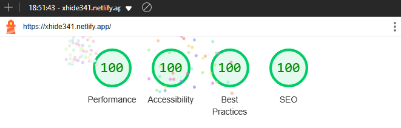

# Portfolio Website

A modern, accessible, and performant portfolio website built with Astro, React, and TailwindCSS. Features interactive UI components, smooth animations, and a responsive design.

## ✨ Features

- **Interactive Magic Cards**: Custom-built components with hover effects and smooth animations
- **Dark Mode Support**: Seamless theme switching with system preference detection
- **Responsive Design**: Mobile-first approach ensuring great UX across all devices
- **Accessibility**: ARIA-compliant with keyboard navigation support
- **Performance Optimized**: Achieves high scores in Lighthouse metrics
- **Modern Tech Stack**: Built with Astro, React, TypeScript, and TailwindCSS

## 🚀 Tech Stack

- [Astro](https://astro.build) - Static Site Generator
- [React](https://reactjs.org) - UI Components
- [TailwindCSS](https://tailwindcss.com) - Styling
- [TypeScript](https://www.typescriptlang.org) - Type Safety
- [Motion One](https://motion.dev) - Animations
- [Swiper](https://swiperjs.com) - Touch Slider
- [PNPM](https://pnpm.io) - Package Manager

## 🎉 Lighthouse Score

## 📝 License

MIT

---

If you find my portfolio website awesome, please consider giving it a ⭐️ on GitHub!